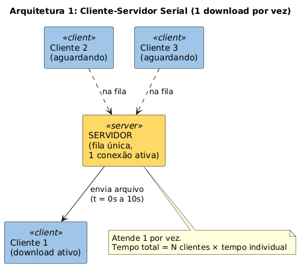
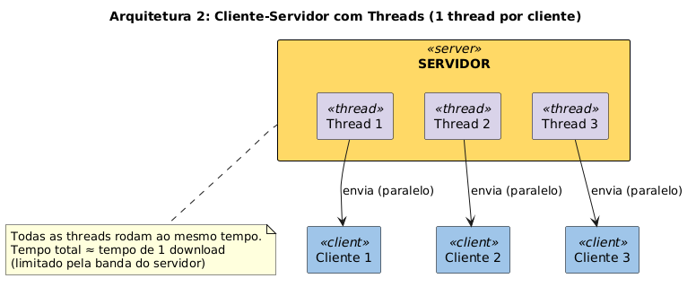
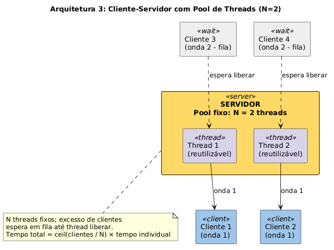
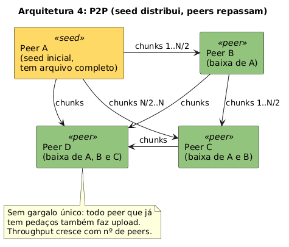

# Atividade 02 — Transferência de Arquivos (Sistemas Distribuídos)

Comparação de 4 arquiteturas de transferência de arquivo — cliente-servidor
serial, concorrente, pool de N conexões, e P2P — medindo tempo min/médio/máx
em 3 tamanhos de arquivo (5MB, 50MB, 500MB).

Código-fonte em [`p2p_src/`](p2p_src/) (Node.js + TypeScript). Ver
[`p2p_src/README.md`](p2p_src/README.md) para setup e comandos.

## 1. Cliente-Servidor Serial

Servidor atende **um cliente por vez**; os demais esperam em fila. Tempo
total cresce linearmente com o número de clientes.

## 2. Cliente-Servidor Concorrente

Servidor atende **todos ao mesmo tempo**, sem fila. Em Node.js isso vem
nativo do event loop assíncrono (sem threads reais).

## 3. Cliente-Servidor Pool (N)

Servidor mantém **N conexões ativas simultâneas** (semáforo); excedente
espera em fila até uma vaga liberar.

## 4. P2P (webtorrent)

Um peer inicial (seed) distribui pedaços do arquivo; peers que já têm algum
pedaço também retransmitem para outros.

## Resultados (localhost, 2 clientes por teste, tempo médio em ms)

| Arquitetura | 5MB | 50MB | 500MB |
|---|---|---|---|
| serial | 29.5 | 346.0 | 2078.0 |
| concorrente | 32.5 | 182.0 | 1769.5 |
| pool (N=2) | 26.0 | 204.0 | 2176.5 |
| p2p | 312.0 | 376.5 | **1359.0** |

P2P tem overhead de protocolo alto em arquivo pequeno (mais lento em 5MB),
mas vira a arquitetura mais rápida das quatro em 500MB — o custo fixo se
dilui conforme o arquivo cresce. Dados brutos completos em
[`p2p_src/resultados_experimento_final.csv`](p2p_src/resultados_experimento_final.csv).

## Decisões de design

Ver [`DECISOES.md`](DECISOES.md) — stack, métrica, formato do CSV, e por que
cada arquitetura foi implementada da forma que foi (ex.: por que serial usa
fila manual em vez de `maxConnections`, por que P2P usa dynamic import).
